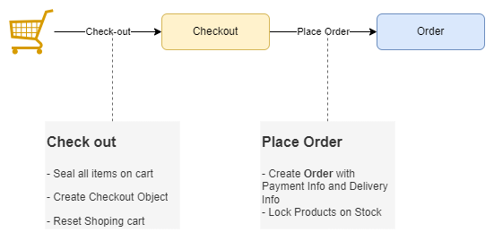

# Order Processing flow

## Overview

Checkout will be created based on the product items on Shopping Cart
Order will be created based on the Checkout

## Checkout Flow

### Checkout Lifecycle

Checkout is an intemediate object created to **snap shot** and **seal the items** for the order placing process. The Checkout object will also contains information collected before the order is placed
 - It will be created with the `CHECKED_OUT` status when the user start the checkout process click "Proceed to checkout" button on cart page. At this stage the Checkout object will only contains the product type and quantity the customer want to order.
 - User will then update the Checkout object with their desired shipping address, shipping provider, and payment method information. 
 - After all the information required has been fulfilled and reflect the customer desired order, all the payment amount and method can be calculated and review by the customer, after which the customer can review, confirm, and start the payment process.
 - After the payment has been processed and confirmed, the Checkout object will be changed to the `PAYMENT_CONFIRMED` state. At this stage, the system can start the create-order process, which will place the necessary block on the inventory, and create a new order for the customer.
 - After an order has been placed, the Checkout has served its purpose, thus its state will be changed to `FULFILLED`. 

### Checkout flow

The Checkout flow happens between when the user begin the checkout process and when the order is placed. This process includes:
- User start this process by navigating to the cart page and click on "Proceed to check out" after choosing all the desired items and their amount. The system will start the checkout process by creating a Checkout object by copying the user's current cart and then clear it. 
- The system then prompt the user for additional information that is necessary for the order placing process. This includes showing the customer available shipping provider, payment provider, their address saved by the system, as well as a form for customer to input a new address should they need to.
- The user will then input the requested information into the system and continually update their Checkout object. After all the necessary information for the object has been inputed, an event to calculate total order amount, delivery fee, and tax amount will be triggered and the result will be displayed to the customer.
- The user can iteratively change their order information at this step. After each change, the order amount, delivery fee, and tax amount will be recalculated and displayed to them.  
- After the customer is satisfied with all their information, they will confirm by clicking ‘Proceed to payment,’ at which point the system will start the payment process for the order.

## Order Processing

The Order will be created after the payment processed is finished and will be the entry point for the fulfilment cycle.

### Order Lifecycle

- After the payment has been confirmed for the order by the Payment Service, an Order with `PAYMENT_CONFIRMED` status will be created from the relevant Checkout object . 
- At this point, the warehouse worker can trigger the action `prepare-parcel` after the have package the order items, this will change the order status to `READY_TO_SHIP`, at which point the desired delivery provider can be contacted to come and pick up the parcel
- After the parcel has been picked up, the action `ship-parcel` will be triggered and the Order's state will be changed to `SHIPPED`.
- When the shipper reach the destination, they can trigger the action `ship-parcel`, which will change the Order's status to `RECEIVED`, at which point the customer can trigger the `confirm-receipt` action and change the order status to `CONFIRMED`, which completes the order.
- During the shipping process (when the order is at the `SHIPPED` state), the shipper can also trigger the `report-failure` action, which will change the order status to `SHIPMENT_FAILED` and start the refund process to refund the payment to the customer.
- At any point before the Order reached the `RECEIVED` state, the customer can trigger the `cancel` action, which will notify the shop of their cancel request and change the Order state to `CANCEL_REQUESTED`.
- At this point, the shop will start the `refund` action and start the refunding process as well as recollect the shipment as required.
- After the `refund-confirm` action triggered to confirm that the refund process has finished, the order status will be changed to `CANCELLED`. 